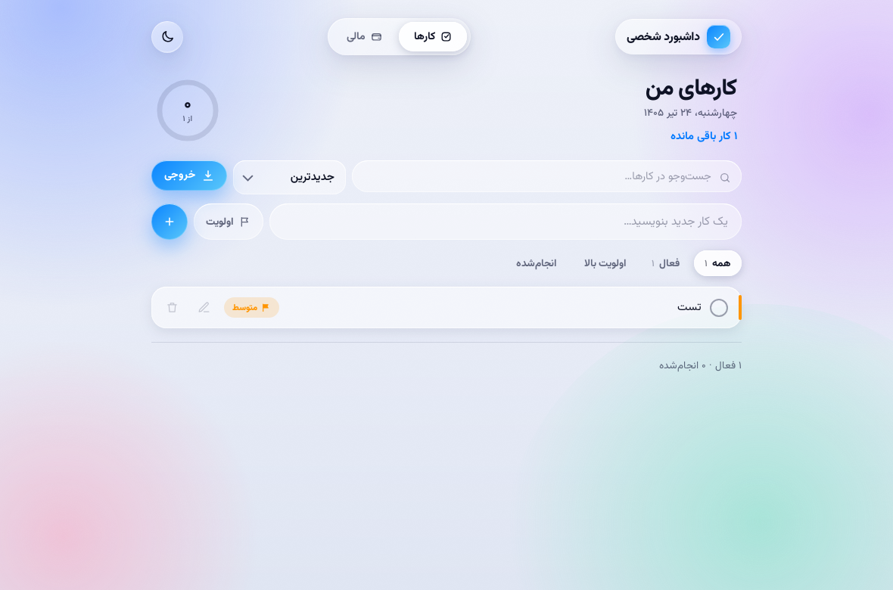
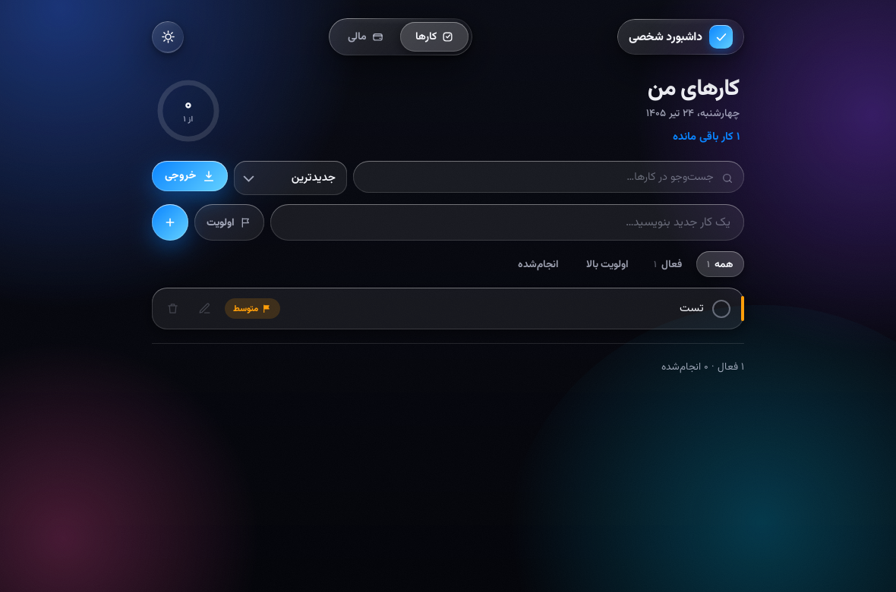

<div dir="rtl">

# داشبورد شخصی 🧊

اپ دسکتاپ سبک برای اوبونتو با ظاهر **Liquid Glass** — مدیریت کارها + امور مالی شخصی، کاملاً فارسی و با تقویم جلالی. همه‌ی داده‌ها به‌صورت خودکار روی دیسک ذخیره می‌شوند.

| حالت روشن | حالت تاریک |
|---|---|
|  |  |

## ویژگی‌ها

- **کارها:** اولویت‌بندی، جست‌وجو، مرتب‌سازی، فیلتر، حلقه‌ی پیشرفت
- **مالی:** درآمد/هزینه، بدهی و قسط، نمودار روند ۶ ماهه، نمودار دسته‌ها، هزینه‌ی هفتگی
- **خروجی:** Markdown ،CSV ،JSON و متن ساده — مستقیم در پوشه‌ی Downloads
- **ذخیره‌سازی دائمی:** هر تغییر بلافاصله در یک فایل JSON نوشته می‌شود
- حالت تاریک/روشن، فونت وزیرمتن باندل‌شده (بدون نیاز به اینترنت)، بک‌گراند شیشه‌ای متحرک

## نصب

از بخش [Releases](../../releases) آخرین نسخه را برای سیستم‌عامل خودتان دانلود کنید:

### اوبونتو / دبیان / مینت (فایل `.deb`)

```bash
sudo apt install ./dashboard-shakhsi_*.deb
```

### فدورا / اوپن‌سوزه (فایل `.rpm`)

```bash
sudo dnf install python3-gobject gtk3 webkit2gtk4.1
sudo rpm -i --nodeps dashboard-shakhsi-*.rpm
```

### ویندوز (فایل `DashboardShakhsi-windows.exe`)

فایل را دانلود و اجرا کنید — نصب لازم ندارد. به WebView2 نیاز دارد که روی ویندوز ۱۰ و ۱۱ به‌روز از قبل نصب است.

### مک (فایل `DashboardShakhsi-macos.zip`)

فایل را باز کنید و `DashboardShakhsi.app` را به پوشه‌ی Applications بکشید. چون برنامه امضای اپل ندارد، بار اول روی آن راست‌کلیک کنید و **Open** را بزنید.

### اندروید (فایل `DashboardShakhsi-android.apk`)

فایل APK را دانلود و نصب کنید (اندروید ۷ به بالا). چون خارج از گوگل‌پلی است، هنگام نصب اجازه‌ی «نصب از منابع ناشناس» را بدهید. برنامه به اینترنت و هیچ مجوز دیگری نیاز ندارد و خروجی‌ها در پوشه‌ی Download گوشی ذخیره می‌شوند.

### سایر توزیع‌های لینوکس

```bash
sudo pacman -S python-gobject gtk3 webkit2gtk-4.1   # آرچ (نمونه)
python3 src/main.py
```

پس از نصب، «داشبورد شخصی» را در منوی برنامه‌ها اجرا کنید، یا در ترمینال:

```bash
dashboard-shakhsi
```

## محل ذخیره‌ی داده‌ها

```
لینوکس:  ~/.local/share/dashboard-shakhsi/data.json
ویندوز:  %APPDATA%\dashboard-shakhsi\data.json
مک:      ~/Library/Application Support/dashboard-shakhsi/data.json
اندروید: حافظه‌ی داخلی برنامه (با حذف برنامه پاک می‌شود — قبل از حذف، از «خروجی JSON» بک‌آپ بگیرید)
```

برای پشتیبان‌گیری کافی است همین یک فایل را کپی کنید. با حذف برنامه، داده‌ها پاک نمی‌شوند.

## ساخت از سورس

پیش‌نیاز فقط `dpkg-deb` است (روی اوبونتو از قبل نصب است):

```bash
./build-deb.sh
sudo apt install ./dist/dashboard-shakhsi_*.deb
```

اجرای مستقیم بدون نصب:

```bash
sudo apt install python3-gi gir1.2-gtk-3.0 gir1.2-webkit2-4.1
python3 src/main.py
```

حالت دیباگ (ابزار توسعه‌دهنده‌ی وب‌کیت): `dashboard-shakhsi --devtools`

## تست‌ها

دو تست دودی، ذخیره و بازیابی داده را در یک HOME ایزوله بررسی می‌کنند:

```bash
sudo apt install python3-gi gir1.2-gtk-3.0 gir1.2-webkit2-4.1 xvfb dbus
dbus-run-session -- xvfb-run -a sh tests/run.sh
```

همین تست‌ها در GitHub Actions روی هر push اجرا می‌شوند و با زدن تگ نسخه (مثل `v1.0.1`) فایل `.deb` به‌صورت خودکار ساخته و در Releases منتشر می‌شود.

## ساختار پروژه

```
src/            اپ — app.html (فونت داخلش جاسازی شده)
                main.py (نسخه‌ی لینوکس/GTK) و desktop.py (ویندوز/مک، با pywebview)
packaging/      فایل desktop و قالب control
assets/         آیکون‌ها و اسکرین‌شات‌ها
tests/          تست‌های دودی
build-deb.sh    ساخت پکیج deb
```

## معماری (خلاصه)

رابط کاربری یک فایل HTML/JS است که داخل WebKitGTK نمایش داده می‌شود. یک لایه‌ی نازک پایتون (GTK3) هنگام شروع، محتوای `data.json` را به صفحه تزریق می‌کند و هر تغییری را از طریق message handler دریافت و به‌صورت اتمیک روی دیسک می‌نویسد. خروجی‌گرفتن فایل‌ها هم از همین مسیر مستقیماً در Downloads ذخیره می‌شود.


## امضای APK اندروید (برای توسعه‌دهنده)

برای اینکه به‌روزرسانی‌های APK روی گوشی کاربران بدون حذف و نصب مجدد انجام شود، همه‌ی نسخه‌ها باید با یک کلید ثابت امضا شوند. کلید را یک بار بسازید (یا از فایل ارائه‌شده استفاده کنید) و به‌عنوان Secret به ریپو اضافه کنید:

```bash
gh secret set ANDROID_KEYSTORE_B64 --body "$(base64 -w0 release.keystore)"
gh secret set ANDROID_KEYSTORE_PASS --body 'رمز-کیستور'
```

اگر این Secretها تنظیم نشده باشند، بیلد نمی‌شکند ولی APK با یک کلید موقت امضا می‌شود. فایل keystore را جای امن نگه دارید و هرگز در ریپو کامیت نکنید.

## لایسنس

کد تحت لایسنس [MIT](LICENSE). فونت [وزیرمتن](https://github.com/rastikerdar/vazirmatn) تحت [SIL OFL 1.1](src/fonts/OFL.txt).

</div>
